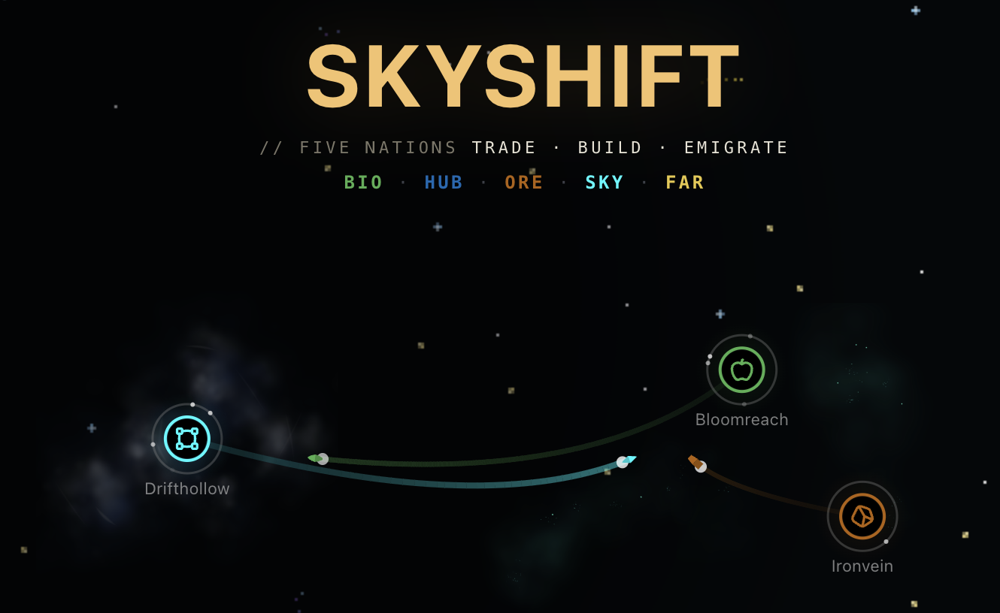
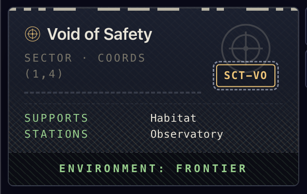
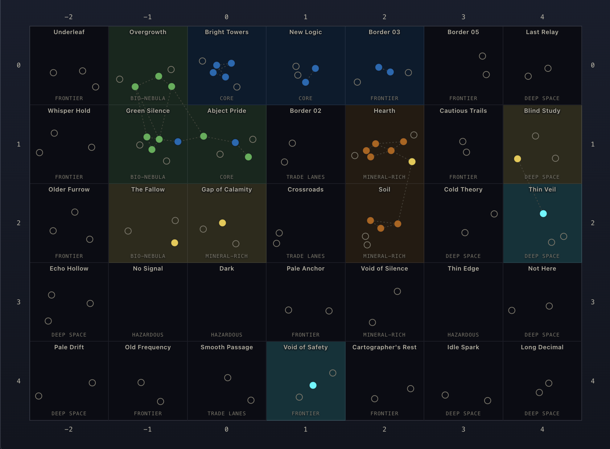
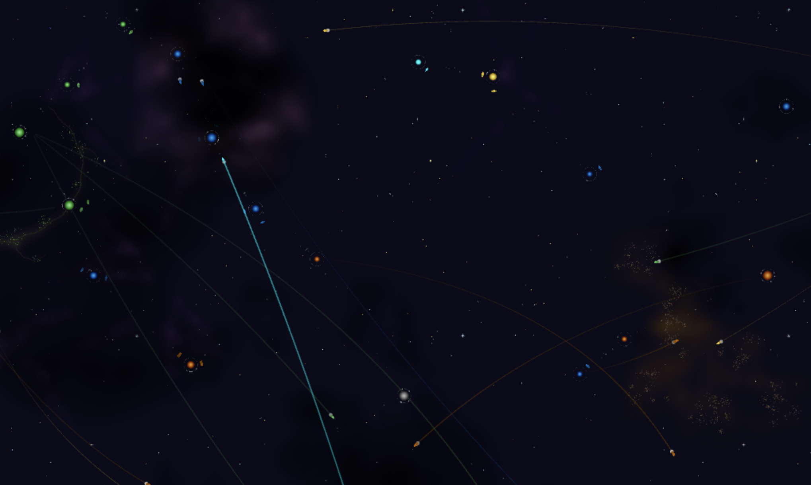
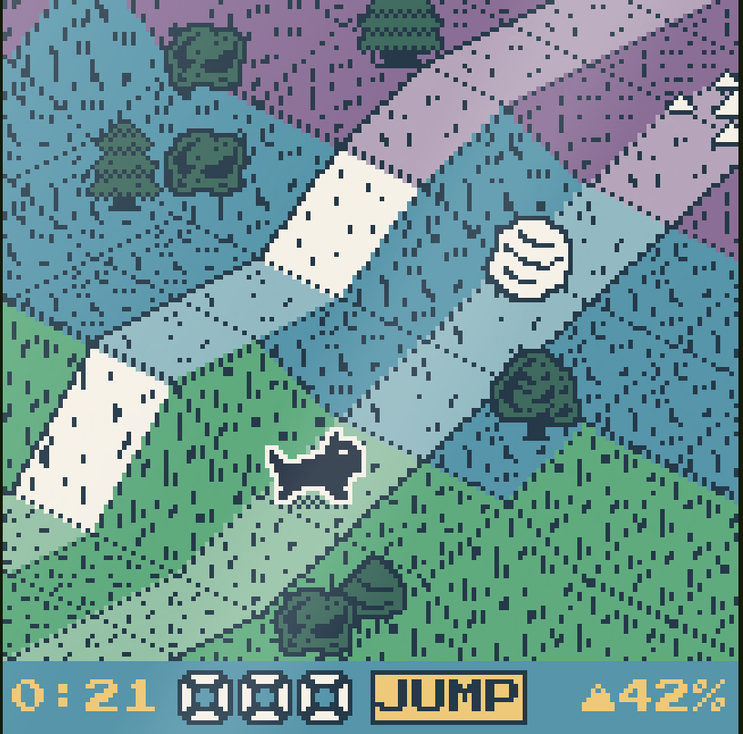

# rudidev08

Recent personal projects.

1. [Skyshift](https://skyshift.rudidev.com): self-running 2D space economy-lite. Almost like a screensaver. [Source](https://github.com/rudidev08/skyshift)

     

   

2. [Toto-Manjaro](https://toto.rudidev.com): one minute long retro game.

   

3. [AI approval queue](https://github.com/rudidev08/ai-approval-queue): personal assistant add-on for approving sensitive changes.

   
